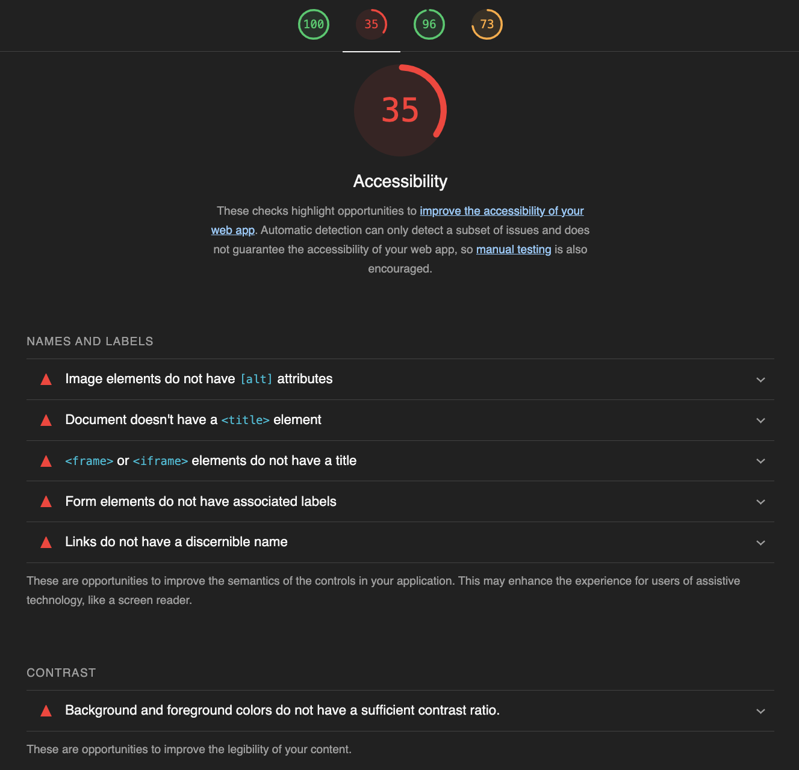

# Accessibility CI demo

[![Node.js CI][ci-img]][ci] (_expected to fail!_)

This repository demonstrates integrating automated accessibility testing tools into a [continuous integration/deployment (CI/CD)][intro] workflow.

* [@nfreear/accessibility-ci-demo][demo1] (_this repo._)
* [@nfreear/accessibility-devops][demo2]

Specifically, it demonstrates the use of two separate tools:

* [jest-axe][] with [Jest][],
* @treosh's [lighthouse-ci-action][].

The repo contains example _fails_ and _passes_ [pages](./pages), and corresponding [unit tests](./__tests__).



## ⚠️✋ This project does not guarantee that what you build is accessible.
The GDS Accessibility team found that only [~30% of issues are found by automated testing][gds].

You'll also need to:
* test your interface with the [assistive technologies that real users use][at] (see also [WebAIM's survey results][survey]).
* include disabled people in user research.

## Usage

```
npm install
npm test
```

[gds]: https://accessibility.blog.gov.uk/2017/02/24/what-we-found-when-we-tested-tools-on-the-worlds-least-accessible-webpage
[at]: https://www.gov.uk/service-manual/technology/testing-with-assistive-technologies#when-to-test
[survey]: https://webaim.org/projects/screenreadersurvey10/#primary
[jest]: https://jestjs.io/
[jest-axe]: https://github.com/nickcolley/jest-axe
[lighthouse-ci-action]: https://github.com/treosh/lighthouse-ci-action
[intro]: https://github.com/GoogleChrome/lighthouse-ci/blob/main/docs/introduction-to-ci.md
  "Introduction to Continuous Integration (Google)"
[demo1]: https://github.com/nfreear/accessibility-ci-demo
  "#1 Demos use of 'jest-axe' and 'lighthouse-ci-action'"
[demo2]: https://github.com/nfreear/accessibility-devops
  "#2 Demos use of 'pa11y-ci' and Cypress"

[ci]: https://github.com/nfreear/accessibility-ci-demo/actions/workflows/node.js.yml
[ci-img]: https://github.com/nfreear/accessibility-ci-demo/actions/workflows/node.js.yml/badge.svg
